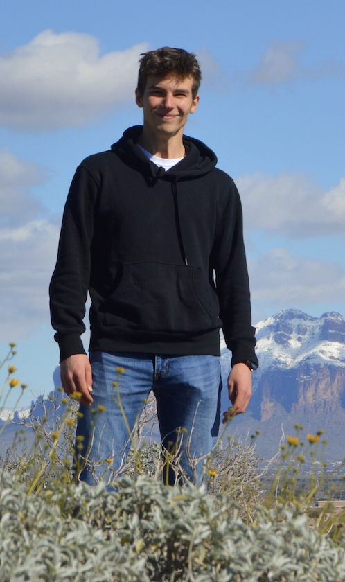

# Dylan C. Gagler
*Computational Biologist | Astrobiologist*

## About Me
I'm a Master's student at Arizona State University, studying astrobiology with Dr. Sara Imari Walker. My research involves accumulating large amounts of genetic and biochemical data for microorganisms to uncover large scale patterns in biochemistry, specifically enzyme usage. My previous work involved geochemical and microbiological fieldwork in Yellowstone National Park, where I collected samples for subsequent laboratory analysis. Outside of research, I love to explore nature, read, and spend time with the people I care about.

[CV](https://github.com/dgagler/dgagler/blob/master/dgagler_CV.pdf) 

[LinkedIn](https://www.linkedin.com/in/dylan-gagler-4a0a68191/) 

# Projects
# [Patterns in life's use of major enzymatic reaction classes](https://nbviewer.jupyter.org/github/dgagler/dgagler/blob/master/enzyme_demo.ipynb)

**Data retrieval, cleaning, analysis, and visualization in python.** A driving question in astrobiology is whether the structure and diversity of life we see on Earth is the result of chemical and evolutionary contingency, or the manifestation of underlying organizational principles. The realization of such principles would inform attempts at synthesizing life in the laboratory, searching for life in the universe, and understanding the origin of life on Earth. For this project, I leverage large amounts of publically available genetic and enzymatic data for organisms across the tree of life in tandem with biochemical reaction data to uncover patterns in life's use of enzyme reaction classes across domains and levels of organization.

# [Microbial Exploration of Spirea Creek, Yellowstone National Park](https://nbviewer.jupyter.org/github/dgagler/dgagler/blob/master/spirea_sequencing_demo.ipynb)

**Microbiological fieldwork, DNA extraction and PCR amplification, sequence analysis and taxonomic classification using QIIME 2, and data visualization in python.** Yellowstone National Park (YNP) is one of the premier locations to study the intersection of geochemistry and microbiology. For this project, I collected microbial samples from a set of previously uncharacterized geochemical hot springs in YNP. DNA was extracted from these samples, amplified via PCR, and subsequently sequenced. I analyzed the sequence data using QIIME 2 and visualized the results using python. This project explores the biology of diverse hot spring ecosystems.
